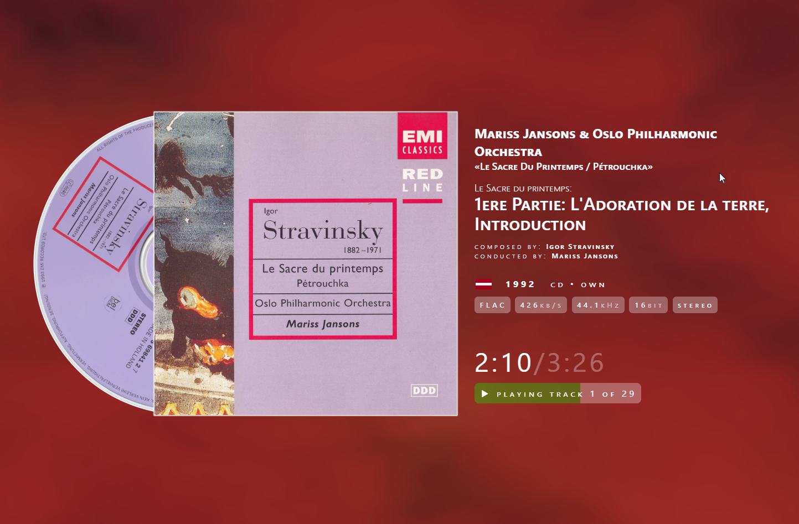
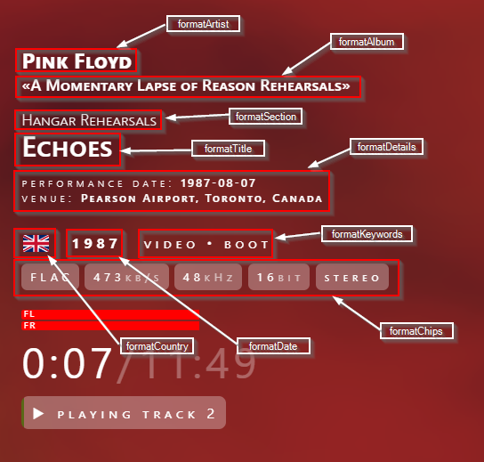

# Now playing screen for foobar2000

The goal of this little project was to create a "now playing" screen that could
be displayed on big TV screens while foobar is playing. To avoid screen damage
(burn-in) from statically displayed elements, the information on screen is animated
and changes its position periodically. Background can be either static color
(i.e., black) or animated, colorful fog.



## Installation

Make sure you have Windows version of [foobar2000](https://www.foobar2000.org/) installed,
toghether with [foo_webview2 plugin](https://www.foobar2000.org/components/view/foo_webview2).

Download this repository to some directory, then configure `foo_webview2` and
point it to `now-playing.html` template. You can display now playing screen using
 `View->WebView2` or add WebView2 as an UI element. See
 [this](https://github.com/jecassis/foo_uie_webview) for details on `foo_webview2`.

## Features

* All metadata is optional; fields that have no value simply disappear from screen.
* It works well with local playback, streaming and playback from one
foobar2000 instance to anoter.
* Nice animation of spinning CD when audio is playing.
* Simple auto-generated "artwork" placeholder when no artwork is available (note:
this won't work if you have default artwork set in foobar2000).
* Custom CD artwork is supported; if no CD artwork is availabe, substitute is
generated based on main artwork (again - this works only if foobar2000 is not
confugured to provide its own fallback artwork).
* Multichannel VU-meter.
* As it was meant as a non-interactive big screen display, there are only two
interactive element: playback button toggles between pause and play on click and
time display toggles between elapsed and remaining time on click (but only if
remaining time is known).
* Almost all information on screen is configurable using foobar2000 formatting scripts.

## Configuration

Copy [config.dist.json](config.dist.json) to file named `config.json`, and locate in the same directory as the main template. Wdit it to customize your screen.

The following options can be used. All values are optional, if you don't have a `config.json` file or remove some values from it, defaults will be used.

| option                        | information                                                                                                           |
| ----------------------------- | --------------------------------------------------------------------------------------------------------------------- |
| colorScheme                   | `dark` or `light`, can also be `dark light` for automatic selection according to your system settings                 |
| fontFamily                    | see [font-family CSS property](https://developer.mozilla.org/en-US/docs/Web/CSS/Reference/Properties/font-family)     |
| fontVariant                   | see [font-variant CSS property](https://developer.mozilla.org/en-US/docs/Web/CSS/Reference/Properties/font-variant)   |
| colorMuteFactor               | transparency of some text elements (i.e. text in parentheses)                                                         |
| alignment                     | `left` for cover on left, meta on right, `right` for reverse, `flip` for animation between `left` and `right`         |
| inverseLayout                 | if `true` then cover art switches sides with metadata.                                                                |
| flipDuration                  | time between information on screen flip from side to side                                                             |
| defaultTimeDisplay            | `elapsed` or `remaining` (note that `remaining` falls back to `elapsed` if total time is unknown, i.e. for streaming) |
| coverStretchThreshold         | if cover width/hight ratio is smaller that this, cover is stretched                                                   |
| coverGeneratorStrLen          | number of characters that is taken to generate automatic cover art                                                    |
| coverGeneratorCharScaleFactor | ratio of the size between consecutive characters                                                                      |
| cdSpinDuration                | the larger the value, the slower CD art spins while playing                                                           |
| cdHideDuration                | how quickly CD art shows/hides when starting/stopping playback                                                        |
| bgStaticColor                 | static background color (when fog effect is disabled)                                                                 |
| bgFogEnabled                  | enable (`true`) or disable (`false`) background fog (can be GPU intensive on slower machines and higher resolutions)  |
| bgFogHighlightColor           | colors of the fog, see [Vanta.js fog](https://www.vantajs.com/?effect=fog) for details and interactive customization  |
| bgFogMidtoneghtColor          | colors of the fog, see [Vanta.js fog](https://www.vantajs.com/?effect=fog) for details and interactive customization  |
| bgFogLowlightColor            | colors of the fog, see [Vanta.js fog](https://www.vantajs.com/?effect=fog) for details and interactive customization  |
| bgFogBaseColor                | colors of the fog, see [Vanta.js fog](https://www.vantajs.com/?effect=fog) for details and interactive customization  |
| vuMeterEnabled                | show (`true`) or hide (`false`) the vu-meter                                                                          |
| vuMeterColor                  | color of the vu-meter                                                                                                 |
| vuMeterFontColor              | color of the vu-meter text (channel symbol)                                                                           |
| countryMappings               | map of country name (lowercase) to two letter country code, used as additional mappings for displaying country flag   |
| formatArtist                  | format used to display artist                                                                                         |
| formatAlbum                   | format used to display album title                                                                                    |
| formatSection                 | format used to display additional subtitle / section (empty by default)                                               |
| formatTitle                   | format used to display track title                                                                                    |
| formatDate                    | format used to display release date                                                                                   |
| formatKeywords                | format used to display keywords (like genre, etc.)                                                                    |
| formatCountry                 | format used to display country flag                                                                                   |
| formatDetails                 | list of formats used to display track details (see below)                                                             |
| formatChips                   | list of formats used to display technical info about the track (see below)                                            |



### Country flags

To properly display a country flag, the template expects `COUNTRY` tag
(or whatever tag you configure using `formatCountry` option) with
two letter country code ([ISO 3166-1 alpha-2](https://www.iso.org/obp/ui/)).

Three-letter codes, as well as official English country names and a few popular common
names, are translated to two-letter standard on the fly.
If your case is not handled well, you can add it to [countries.js](countries.js).

### formatDetails

This option defines a section with various details. Each element consists of detail `title` as well as `format` used to obtain it.

For example:

```json
"formatDetails": [
    {"title": "venue: ", "format": "[%venue%]"}
]
```

Note that if you add this config option you'll overwrite all information configured
by default, so rather edit default values that start from scratch.

### formatChips

This option defines a section with short technical details. Each element consists of
`format` used to obtain the value and optional `suffix` and `prefix` that can be
used to add unit, etc.

For example:

```json
"formatChips": [
    {"format": "[%bitrate%]", "suffix": "kbps" },
    {"format": "[%album dynamic range%]", "prefix": "DR" }
]
```

Again you can only edit this option as a whole, your value will overwrite defaults.

## Acknowledgements

This template uses the following open-source components:

* MIT licensed fog effect from [tengbao/vanta](https://github.com/tengbao/vanta)
* MIT licensed three.js library from [mrdoob/three.js](https://github.com/mrdoob/three.js/)
* MIT licensed SVG flags from [lipis/flag-icons](https://github.com/lipis/flag-icons)

All this was possible thanks to [foobar2000 player](https://www.foobar2000.org/)
and [foo_webview2 plugin](https://github.com/jecassis/foo_uie_webview).

## License

This code is [MIT licensed](license.txt).